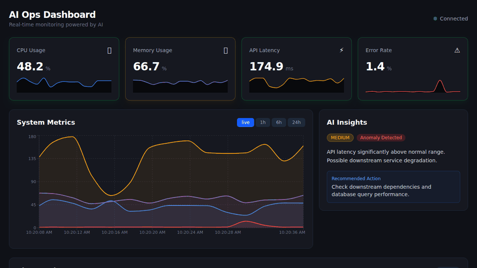

# AI Ops Dashboard

Real-time infrastructure monitoring dashboard with AI-powered anomaly detection. Built with React, Node.js, WebSocket, PostgreSQL, and Claude AI.



## Overview

AI Ops Dashboard simulates a production monitoring environment where system metrics stream in real-time and an AI agent continuously analyzes patterns to detect anomalies. When something looks wrong, the AI generates natural-language alerts explaining what happened and what to do about it.

This project demonstrates full-stack real-time architecture: a metrics simulator feeds data through a Node.js backend into PostgreSQL, where a sliding-window anomaly detector sends aggregated metrics to Claude AI for pattern analysis. Results stream to a React dashboard via WebSocket.

## Features

- **Real-time metric streaming** — CPU, memory, latency, and error rate update every 2 seconds via WebSocket
- **AI anomaly detection** — Claude AI analyzes 5-minute metric windows every 30 seconds, returning severity assessments and recommended actions
- **Natural-language alerts** — AI-generated descriptions explain anomalies in plain English
- **Historical analysis** — Query metrics over 1h, 6h, or 24h time ranges
- **Dark theme dashboard** — Production-style monitoring UI with sparkline cards, multi-series charts, and an alert feed
- **Mock fallback** — Runs without an API key using rule-based anomaly detection

## Tech Stack

| Technology | Purpose |
|---|---|
| React 19 + TypeScript | Frontend UI |
| Recharts | Real-time charts and sparklines |
| Tailwind CSS | Styling (dark theme) |
| Socket.io | WebSocket real-time communication |
| Node.js + Express | Backend API server |
| PostgreSQL 16 | Metrics storage and aggregation |
| Anthropic Claude API | AI anomaly analysis |
| Swagger/OpenAPI | API documentation |
| Docker + docker-compose | Container orchestration |
| GitHub Actions | CI pipeline |

## Architecture

```
┌─────────────┐    ┌──────────────────────────────────────────────┐
│  Simulator   │───▶│              Node.js Backend                 │
│  (2s ticks)  │    │                                              │
└─────────────┘    │  ┌──────────┐  ┌───────────┐  ┌───────────┐ │
                   │  │ Express  │  │ Socket.io │  │  Swagger  │ │
                   │  │ REST API │  │  Server   │  │  /api-docs│ │
                   │  └────┬─────┘  └─────┬─────┘  └───────────┘ │
                   │       │              │                        │
                   │  ┌────▼──────────────▼────┐                  │
                   │  │      PostgreSQL         │                  │
                   │  │  metrics_history        │                  │
                   │  │  ai_analyses            │                  │
                   │  │  alerts                 │                  │
                   │  └────────────┬────────────┘                  │
                   │               │                               │
                   │  ┌────────────▼────────────┐                  │
                   │  │   Anomaly Detector      │                  │
                   │  │   (30s analysis cycle)   │                  │
                   │  │         │                │                  │
                   │  │    ┌────▼─────┐         │                  │
                   │  │    │ Claude AI│         │                  │
                   │  │    │   API    │         │                  │
                   │  │    └──────────┘         │                  │
                   │  └─────────────────────────┘                  │
                   └──────────────────┬────────────────────────────┘
                                      │ WebSocket
                   ┌──────────────────▼────────────────────────┐
                   │           React Frontend                   │
                   │                                            │
                   │  ┌────────┐ ┌──────────┐ ┌─────────────┐ │
                   │  │ Metric │ │ Realtime │ │ AI Insights │ │
                   │  │ Cards  │ │  Chart   │ │   Panel     │ │
                   │  └────────┘ └──────────┘ └─────────────┘ │
                   │  ┌──────────────┐ ┌────────────────────┐  │
                   │  │  Alert Feed  │ │  Alert Detail      │  │
                   │  │              │ │  Modal             │  │
                   │  └──────────────┘ └────────────────────┘  │
                   └───────────────────────────────────────────┘
```

See [docs/ARCHITECTURE.md](docs/ARCHITECTURE.md) for detailed data flow and design decisions.

## Quick Start

```bash
# Clone the repository
git clone https://github.com/ginanjar-fm/ai-ops-dashboard.git
cd ai-ops-dashboard

# Copy environment variables
cp .env.example .env

# (Optional) Add your Anthropic API key for real AI analysis
# Without it, the app uses rule-based mock detection
echo "ANTHROPIC_API_KEY=sk-ant-..." >> .env

# Start everything
docker-compose up --build
```

Open [http://localhost:3000](http://localhost:3000) to see the dashboard. Metrics start streaming immediately. The first AI analysis runs within 30 seconds.

## API Reference

### REST Endpoints

| Method | Endpoint | Description |
|---|---|---|
| GET | `/api/health` | Health check |
| GET | `/api/metrics/current` | Latest metric data point |
| GET | `/api/metrics/history?range=1h\|6h\|24h` | Historical metrics |
| GET | `/api/alerts` | Recent alerts (max 50) |
| GET | `/api/alerts/:id` | Alert detail with AI analysis |
| GET | `/api/config` | Current threshold configuration |
| POST | `/api/config` | Update alert thresholds |
| GET | `/api-docs` | Swagger UI documentation |

### WebSocket Events

| Event | Direction | Description |
|---|---|---|
| `metrics_update` | Server → Client | New metric point (every 2s) |
| `anomaly_detected` | Server → Client | AI analysis result |
| `new_alert` | Server → Client | New alert created |

See [docs/API.md](docs/API.md) for full API reference with request/response schemas.

## How AI Anomaly Detection Works

The anomaly detection pipeline runs on a 30-second cycle with three stages:

**1. Data Collection.** The detector queries all metrics from the last 5 minutes from PostgreSQL. This sliding window captures enough context for trend analysis while staying responsive to sudden changes.

**2. LLM Analysis.** The 5-minute metric window is summarized and sent to Claude AI with context about normal operating ranges (CPU 20-60%, memory 40-70%, latency 50-200ms, errors 0-2%). The LLM evaluates the metrics holistically — it can detect patterns that simple threshold checks miss, like correlated spikes across multiple metrics or gradual degradation trends.

**3. Alert Generation.** When the LLM flags an anomaly, it returns a severity level (critical/high/medium/low), a natural-language description of what it observed, and a recommended action. This is stored in the database and broadcast to connected clients via WebSocket. The dashboard updates instantly — no polling required.

**Fallback Mode.** When no Anthropic API key is configured, the system uses rule-based detection: CPU > 85% is high severity, latency > 500ms is medium, error rate > 10% is high, and combinations escalate to critical. This ensures the app is fully functional for demo purposes without API costs.

## Environment Variables

| Variable | Required | Description |
|---|---|---|
| `DATABASE_URL` | Yes | PostgreSQL connection string |
| `ANTHROPIC_API_KEY` | No | Anthropic API key for Claude AI analysis. Falls back to mock detection if not set |
| `PORT` | No | Backend port (default: 3001) |
| `NODE_ENV` | No | Environment (default: development) |
| `VITE_API_URL` | No | Backend URL for frontend (default: http://localhost:3001) |

## Project Structure

```
ai-ops-dashboard/
├── backend/
│   ├── src/
│   │   ├── server.ts              # Express + Socket.io server
│   │   ├── database.ts            # PostgreSQL connection & schema
│   │   ├── routes/
│   │   │   ├── metrics.ts         # /api/metrics endpoints
│   │   │   ├── alerts.ts          # /api/alerts endpoints
│   │   │   └── config.ts          # /api/config endpoints
│   │   ├── services/
│   │   │   ├── simulator.ts       # Metrics generator (2s interval)
│   │   │   ├── anomaly-detector.ts # Detection pipeline (30s cycle)
│   │   │   └── llm-service.ts     # Claude AI integration
│   │   └── models/
│   │       └── types.ts           # TypeScript interfaces
│   ├── tests/
│   │   └── health.test.ts
│   ├── Dockerfile
│   └── package.json
├── frontend/
│   ├── src/
│   │   ├── App.tsx                # Main dashboard layout
│   │   ├── components/
│   │   │   ├── MetricCard.tsx     # Metric card with sparkline
│   │   │   ├── RealtimeChart.tsx  # Multi-series area chart
│   │   │   ├── AIInsightsPanel.tsx # AI analysis display
│   │   │   ├── AlertFeed.tsx      # Scrollable alert list
│   │   │   └── AlertDetailModal.tsx # Alert detail modal
│   │   ├── hooks/
│   │   │   └── useWebSocket.ts    # Socket.io client hook
│   │   └── types/
│   │       └── index.ts
│   ├── nginx.conf                 # Reverse proxy config
│   ├── Dockerfile
│   └── package.json
├── docker-compose.yml
├── .github/workflows/ci.yml
├── .env.example
└── docs/
    ├── ARCHITECTURE.md
    └── API.md
```

## Development

```bash
# Backend (requires PostgreSQL running)
cd backend
npm install
npm run dev

# Frontend (separate terminal)
cd frontend
npm install
npm run dev
```

Backend runs on port 3001, frontend on port 5173 (Vite dev server).

## License

MIT
